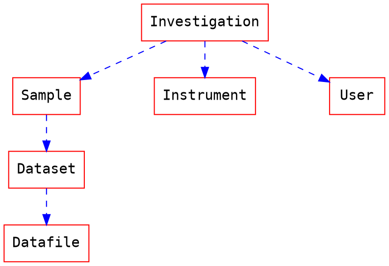
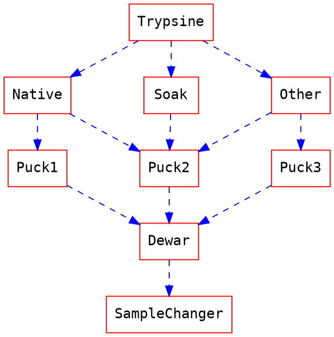

This document describes how the data and the metadata from the MX experiments could be stored in a metadata catalogue in a generic and extensible manner.

## Metadata catalogue

### Database
This document assumes that the metadata catalogue is ICAT-like based with, at least, the follow entities:
1. Investigation: It contains all information concerning the experimental session or the proposal. 
2. User: a user is a person that participates in a experiment and has a role (local contact, proposer, scientists, co-proposer, etc...)
3. Sample: it is the specimen that will be collected in a instrument

## Experiments

### Sample description and tracking

Before the experiment and optionally, it is possible to describe the samples, how they will be shipped, acquired and processed.
This includes:
- Shipment: Send of the samples to the facility
- Sample changer location: location of the samples in the SC
- Information about how samples should be collected and processed
    - Experimental plan: how data will be acquired?
    - Processing plan: how data will be processed?

#### Example
