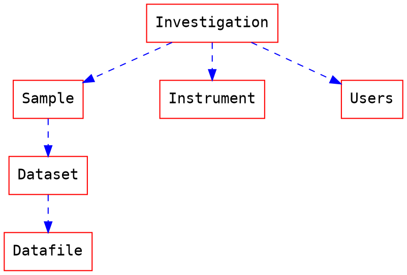
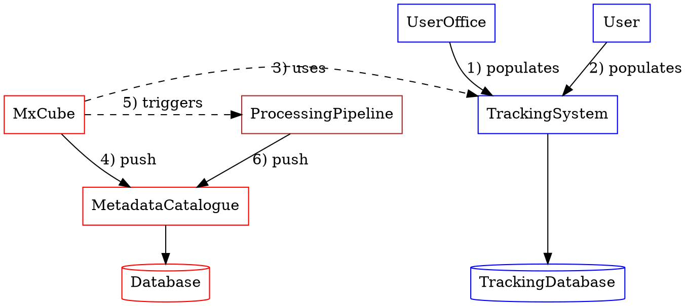
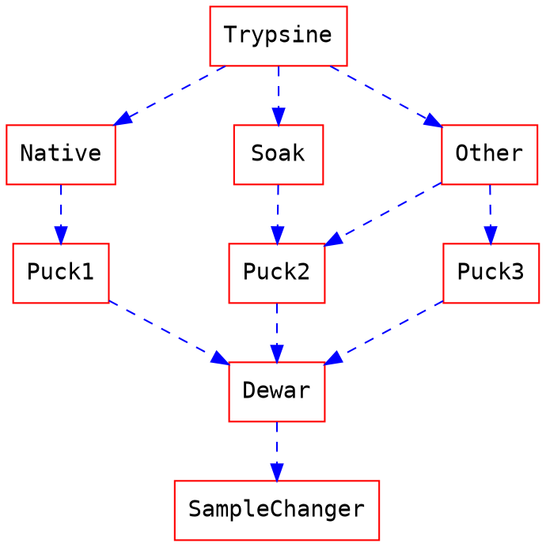
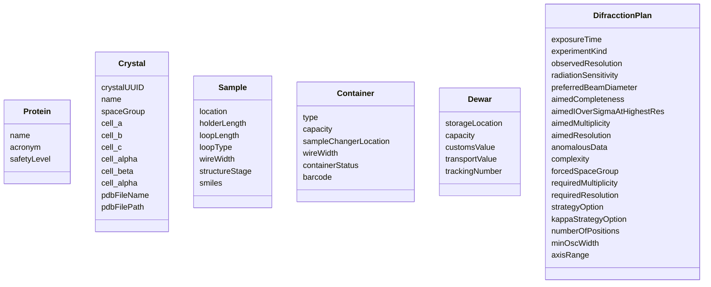

This document describes how the data and the metadata from the MX experiments could be stored in a metadata catalogue in a generic and extensible manner.

# Background

## Metadata catalogue

### Database
This document assumes that the metadata catalogue is ICAT-like based with, at least, the follow entities:
1. Investigation: It contains all information concerning the experimental session or the proposal. 
2. User: a user is a person that participates in a experiment and has a role (local contact, proposer, scientists, co-proposer, etc...)
3. Sample: it is the specimen that will be collected in a instrument



### Data flow


This section summarizes how the sample information is inserted into the system, trasnferred to the data acquisition software and then gets catalogued after the data acquisition.

>  Note: The tracking system has become optional and has its own database. Even if for automated or highly automated beamlines the tracking system is most likely to be mandatory, in principle it could be possible to run the experiment without Sample tracking system.

---

1. **[optional]** Information about the nature of the sample (chemical formula, protein acronym, safety level, etc..) is populated from the user office management system to the sample tracking management system. This process is done automatically.
2. **[optional]** Users can enrich the sample information already retrieved from the step 1 with:
* Shipping information: parcel, container type and location etc..
* Experimental plan: data acquisition parameters (exposure time, number f images, etc..)
* Processing plan: processing parameters (name of pipelines, force speace group, etc...)
3. **[optional]** Information about the sample can be retrieved by MxCube from the TrackingSystem
4. Data and metadata are pushed from MxCube to the metadata catalogue. This step consists on the automatic capture of the metadata that will be then 
5. **[optional]** When available, MxCube can triggers the online data anlysis
6. **[optional]** Results of the pipelines will be catalogued in the same way as the raw data

---


## Tracking system

### Sample description and tracking [Optional]

Before the experiment and optionally, it is possible to describe the samples, how they will be shipped, acquired and processed.
This includes:
- Shipment
    - Parcel description and tracking: Where the parcel is at any time and what is its content
- Sample changer location
- Information about how samples should be collected and processed
    - Experimental plan: how data will be acquired?
    - Processing plan: how data will be processed?
#### Example

This diagram shows the high level entities which information could  eventually be stored in the `SampleTracking` database. 



### Sample tracking metadata requirements

Currently in ISPyB, the main entities currently used in the description and tracking of the sample are:
1. Protein
2. Crystal
3. Sample
4. Container
5. Dewar
6. Diffraction Plan

The next diagram shows the main fields of such entities:



Furthermore, a processing plan has been added to the model. Note that a processing plan can have one or more `HighResolutonCutoffCriterion`:
```mermaid
classDiagram
      ProcessingPlan <|-- HighResolutonCutoffCriterion
      class ProcessingPlan{
              Name
            UserParameter
            ReferenceHKLPath
            StatisticsProgram
            StatisticsBinning
            StatisticsNumberOfBins
            MolecularReplacementFromCell
            MolecularReplacementFromUserModel
            High_Resoluton_Cutoff_Criteria
      }
      
      class HighResolutonCutoffCriterion{
            HighResolutionCutoffIsotropic
            HighResolutionCutoffCriterion
            HighResolutionCutoffLowThreshold
            HighResolutionCutoffHighThreshold

      }
 ```
 
>  Note: The name of the fields are still be decided. Ideally, by following the Nexus convention when possible or any kind of ontology

### Implementation

The sample tracking data model is the result of generalizing the above to support any kind of experiment.

```mermaid
classDiagram      
      Shipment *-- Parcel : hasParcels
      Parcel *-- Item : hasItems
      Item *-- Item : hasItems
      Item *-- Parameter 
      class Shipment{
          name
          investigationId
          investigationName
          courierAccount
          courierCompany
          description
          comments
          status
          defaultReturnAddress
          defaultShippingAddress
          parcels
      }
    
   
      class Parcel{
          name
          shipmentId
          description
          containsDangerousGoods
          currentStatus
          statuses
          returnAddress
          shippingAddress
          storageConditions
          defaultShippingAddress
          comments
          content : [Item]
      }
      
      class Item{
          name          
          description
          sampleId
          type
          comments
          containerType
          sampleContainerPosition
          content : [Item]
          experimentPlan : [Parameter]
          processingPlan : [Parameter]
      }
      
         class Parameter{
          key          
          value          
      }
```